# 校园二手教材循环交易平台 - 大连理工大学数据库演习大作业

## 1. 需求分析

### 项目概述

校园二手教材循环交易平台是一个专为大学生设计的教材买卖系统，旨在实现教材资源的循环利用，减少学生的教材成本，促进校园内知识的传递。

### 功能需求

#### 用户管理功能

- 用户注册与登录
- 个人信息管理
- 信用评分系统
- 用户活动统计

#### 教材信息管理

- 教材基本信息录入
- 课程关联管理
- 教材版本控制
- 价格参考信息

#### 商品发布与管理

- 二手教材发布
- 商品状态管理（可售、已预订、已售）
- 商品搜索与筛选
- 智能匹配推荐

#### 求购需求管理

- 求购信息发布
- 需求匹配算法
- 状态跟踪（求购中、已匹配、已关闭）

#### 交易管理

- 交易订单创建
- 交易状态跟踪
- 预约时间地点
- 交易完成确认

#### 评价系统

- 交易双方互评
- 教材质量评价
- 描述准确性评价
- 信用积分更新

### 界面原型设计

#### 登陆界面

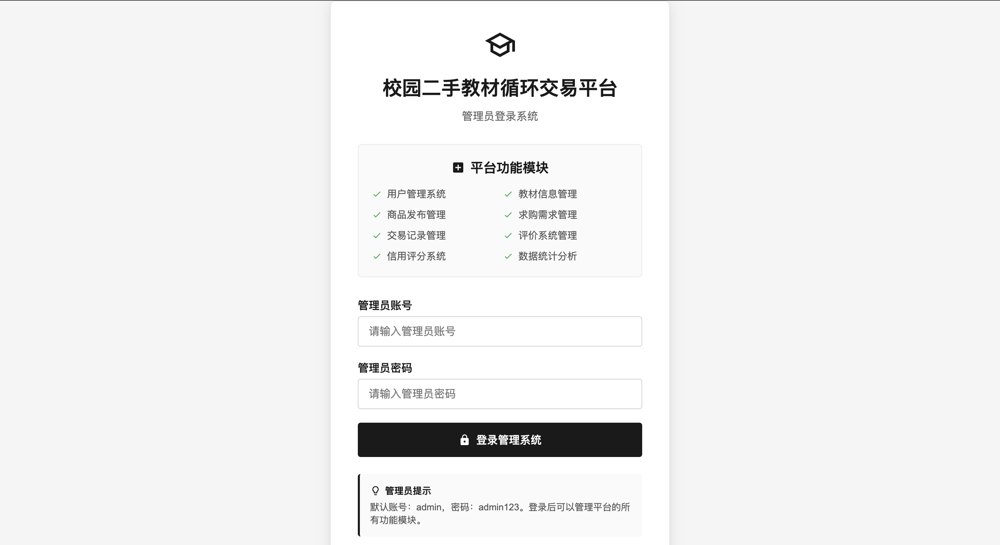

#### 教材管理

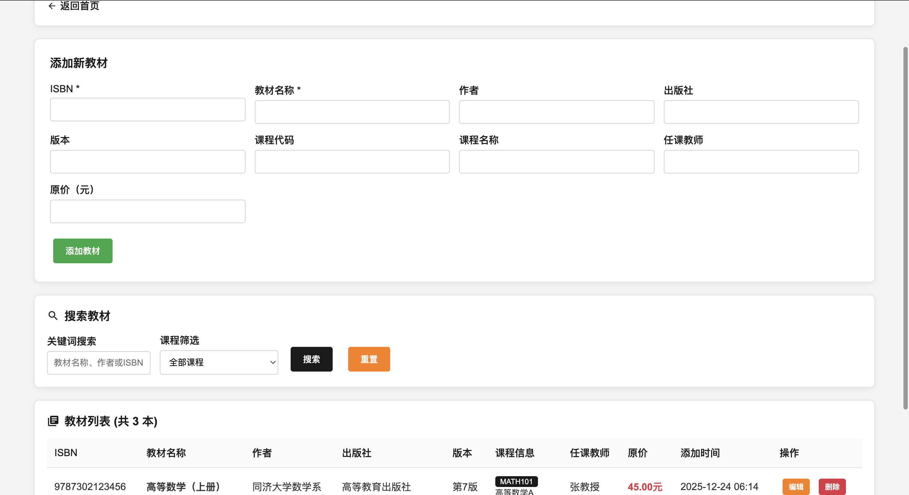

#### 首页界面

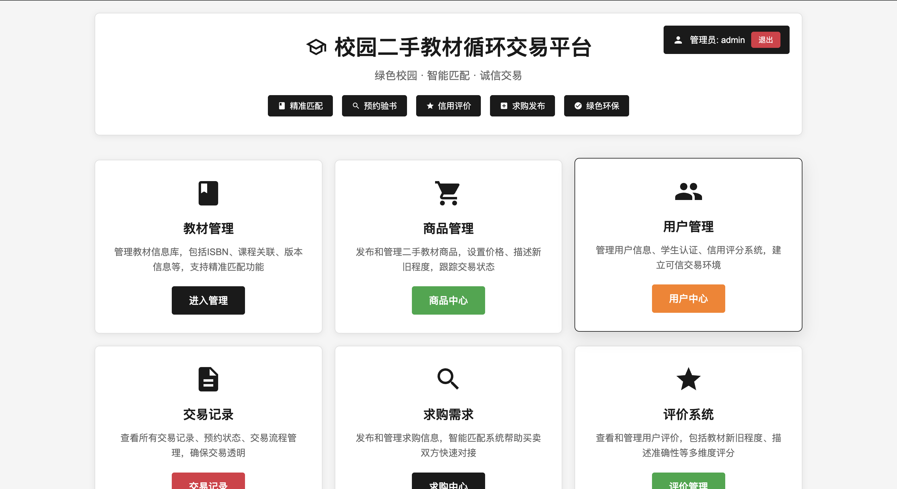

#### 用户管理界面

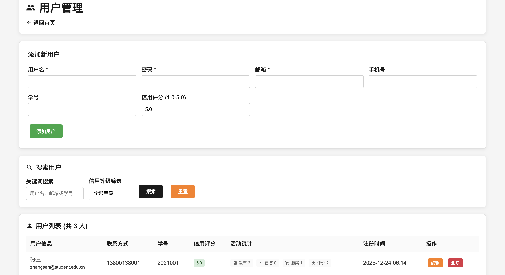

#### 商品发布界面

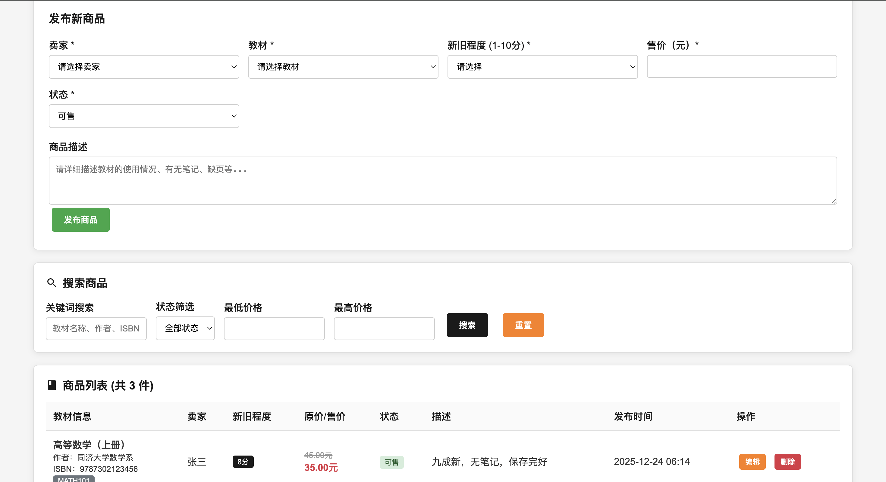

#### 求购需求界面

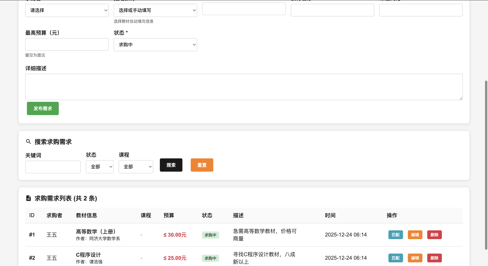

#### 交易管理界面

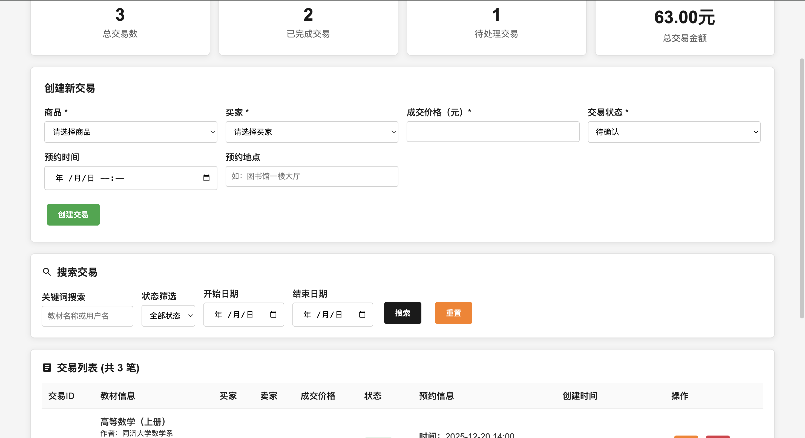

#### 评价系统界面

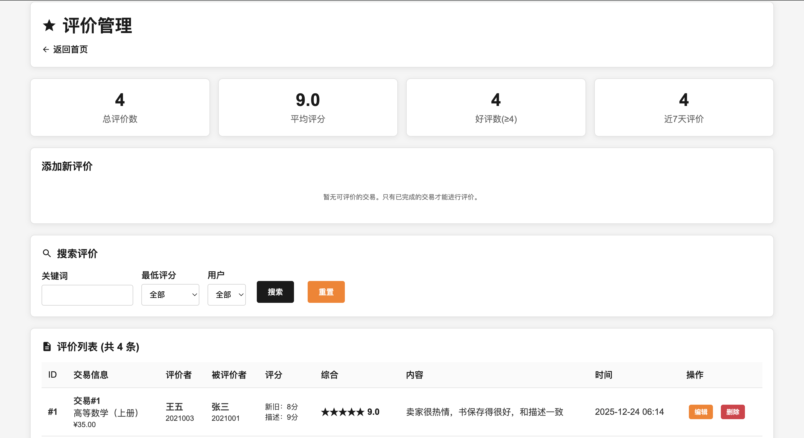

## 2. 模块属性、唯一标识、存储特点

### 用户管理模块 (users)

**唯一标识**: user_id (INT PRIMARY KEY AUTO_INCREMENT)
**核心属性**:

- username: 用户名，字符串，唯一
- email: 邮箱地址，字符串，唯一  
- password: 密码，哈希存储
- student_id: 学号，字符串
- credit_score: 信用评分，数值型(1.0-5.0)
  **存储特点**: 用户数据永久存储，支持级联删除，信用评分实时更新

### 教材信息模块 (textbooks)

**唯一标识**: book_id (INT PRIMARY KEY AUTO_INCREMENT)
**核心属性**:

- isbn: ISBN号码，字符串，唯一
- title: 教材标题，字符串
- course_code: 课程代码，字符串
- original_price: 原价，数值型
  **存储特点**: 教材信息基础数据，相对稳定，支持版本控制

### 商品发布模块 (products)

**唯一标识**: product_id (INT PRIMARY KEY AUTO_INCREMENT)
**核心属性**:

- seller_id: 卖家ID，外键关联users
- book_id: 教材ID，外键关联textbooks
- selling_price: 售价，数值型
- condition_score: 新旧程度(1-10分)，数值型
- status: 状态枚举(available/reserved/sold)
  **存储特点**: 商品数据动态更新，状态频繁变化，支持地理位置和图片存储

### 求购需求模块 (purchase_requests)

**唯一标识**: request_id (INT PRIMARY KEY AUTO_INCREMENT)
**核心属性**:

- buyer_id: 求购者ID，外键关联users
- max_price: 最高预算，数值型，可为空
- status: 状态枚举(active/matched/closed)
- description: 详细描述，文本
  **存储特点**: 需求数据短期存储，状态变化频繁，支持智能匹配

### 交易管理模块 (transactions)

**唯一标识**: transaction_id (INT PRIMARY KEY AUTO_INCREMENT)
**核心属性**:

- product_id: 商品ID，外键关联products
- buyer_id: 买家ID，外键关联users
- seller_id: 卖家ID，外键关联users
- price: 成交价格，数值型
- status: 状态枚举(pending/confirmed/completed/cancelled)
  **存储特点**: 交易数据永久存储，状态链式更新，支持时间预约

### 评价系统模块 (reviews)

**唯一标识**: review_id (INT PRIMARY KEY AUTO_INCREMENT)
**核心属性**:

- transaction_id: 交易ID，外键关联transactions
- reviewer_id: 评价者ID，外键关联users
- reviewed_id: 被评价者ID，外键关联users
- overall_score: 总体评分(1-10)，数值型
  **存储特点**: 评价数据永久存储，用于信用计算，单向关联

## 3. 逻辑设计 - ER图


## 4. 数据库表结构设计

### 表数量统计

本系统共设计 **7个数据表**：

### 表结构详细描述

#### 4.1 管理员表 (admins)

**表名**: `admins`
**用途**: 存储平台管理员账户信息

| 字段名        | 数据类型      | 长度  | 是否为空 | 默认值               | 说明        |
| ---------- | --------- | --- | ---- | ----------------- | --------- |
| admin_id   | INT       | -   | NO   | AUTO_INCREMENT    | 管理员ID，主键  |
| username   | VARCHAR   | 50  | NO   | -                 | 用户名，唯一    |
| password   | VARCHAR   | 255 | NO   | -                 | 密码（MD5加密） |
| created_at | TIMESTAMP | -   | NO   | CURRENT_TIMESTAMP | 创建时间      |
| updated_at | TIMESTAMP | -   | NO   | CURRENT_TIMESTAMP | 更新时间      |

#### 4.2 用户表 (users)

**表名**: `users`
**用途**: 存储平台用户基本信息

| 字段名          | 数据类型      | 长度  | 是否为空 | 默认值               | 说明            |
| ------------ | --------- | --- | ---- | ----------------- | ------------- |
| user_id      | INT       | -   | NO   | AUTO_INCREMENT    | 用户ID，主键       |
| username     | VARCHAR   | 50  | NO   | -                 | 用户名，唯一        |
| password     | VARCHAR   | 255 | NO   | -                 | 密码（MD5加密）     |
| email        | VARCHAR   | 100 | NO   | -                 | 邮箱地址，唯一       |
| phone        | VARCHAR   | 20  | YES  | NULL              | 手机号码          |
| student_id   | VARCHAR   | 20  | YES  | NULL              | 学号            |
| credit_score | DECIMAL   | 3,1 | NO   | 5.0               | 信用评分(1.0-5.0) |
| created_at   | TIMESTAMP | -   | NO   | CURRENT_TIMESTAMP | 创建时间          |
| updated_at   | TIMESTAMP | -   | NO   | CURRENT_TIMESTAMP | 更新时间          |

#### 4.3 教材信息表 (textbooks)

**表名**: `textbooks`
**用途**: 存储教材基础信息

| 字段名            | 数据类型      | 长度   | 是否为空 | 默认值               | 说明        |
| -------------- | --------- | ---- | ---- | ----------------- | --------- |
| book_id        | INT       | -    | NO   | AUTO_INCREMENT    | 教材ID，主键   |
| isbn           | VARCHAR   | 20   | NO   | -                 | ISBN号码，唯一 |
| title          | VARCHAR   | 200  | NO   | -                 | 教材标题      |
| author         | VARCHAR   | 100  | YES  | NULL              | 作者        |
| publisher      | VARCHAR   | 100  | YES  | NULL              | 出版社       |
| edition        | VARCHAR   | 20   | YES  | NULL              | 版本信息      |
| course_code    | VARCHAR   | 20   | YES  | NULL              | 课程代码      |
| course_name    | VARCHAR   | 100  | YES  | NULL              | 课程名称      |
| teacher_name   | VARCHAR   | 50   | YES  | NULL              | 任课教师      |
| original_price | DECIMAL   | 10,2 | YES  | NULL              | 原价        |
| created_at     | TIMESTAMP | -    | NO   | CURRENT_TIMESTAMP | 创建时间      |

#### 4.4 商品表 (products)

**表名**: `products`
**用途**: 存储用户发布的二手教材商品

| 字段名             | 数据类型      | 长度   | 是否为空 | 默认值               | 说明                          |
| --------------- | --------- | ---- | ---- | ----------------- | --------------------------- |
| product_id      | INT       | -    | NO   | AUTO_INCREMENT    | 商品ID，主键                     |
| seller_id       | INT       | -    | NO   | -                 | 卖家ID，外键                     |
| book_id         | INT       | -    | NO   | -                 | 教材ID，外键                     |
| condition_score | TINYINT   | -    | NO   | 5                 | 新旧程度评分(1-10)                |
| selling_price   | DECIMAL   | 10,2 | NO   | -                 | 售价                          |
| description     | TEXT      | -    | YES  | NULL              | 商品描述                        |
| status          | ENUM      | -    | NO   | 'available'       | 状态(available/reserved/sold) |
| images          | VARCHAR   | 500  | YES  | NULL              | 图片路径(逗号分隔)                  |
| created_at      | TIMESTAMP | -    | NO   | CURRENT_TIMESTAMP | 创建时间                        |
| updated_at      | TIMESTAMP | -    | NO   | CURRENT_TIMESTAMP | 更新时间                        |

**外键约束**:

- seller_id → users(user_id)
- book_id → textbooks(book_id)

#### 4.5 求购需求表 (purchase_requests)

**表名**: `purchase_requests`
**用途**: 存储用户的求购需求信息

| 字段名         | 数据类型      | 长度   | 是否为空 | 默认值               | 说明                        |
| ----------- | --------- | ---- | ---- | ----------------- | ------------------------- |
| request_id  | INT       | -    | NO   | AUTO_INCREMENT    | 需求ID，主键                   |
| buyer_id    | INT       | -    | NO   | -                 | 求购者ID，外键                  |
| book_id     | INT       | -    | YES  | NULL              | 指定教材ID，外键                 |
| isbn        | VARCHAR   | 20   | YES  | NULL              | ISBN号码                    |
| title       | VARCHAR   | 200  | YES  | NULL              | 教材名称                      |
| course_code | VARCHAR   | 20   | YES  | NULL              | 课程代码                      |
| max_price   | DECIMAL   | 10,2 | YES  | NULL              | 最高预算                      |
| description | TEXT      | -    | YES  | NULL              | 详细描述                      |
| status      | ENUM      | -    | NO   | 'active'          | 状态(active/matched/closed) |
| created_at  | TIMESTAMP | -    | NO   | CURRENT_TIMESTAMP | 创建时间                      |
| updated_at  | TIMESTAMP | -    | NO   | CURRENT_TIMESTAMP | 更新时间                      |

**外键约束**:

- buyer_id → users(user_id)
- book_id → textbooks(book_id)

#### 4.6 交易记录表 (transactions)

**表名**: `transactions`
**用途**: 存储交易订单信息

| 字段名                  | 数据类型      | 长度   | 是否为空 | 默认值               | 说明                                        |
| -------------------- | --------- | ---- | ---- | ----------------- | ----------------------------------------- |
| transaction_id       | INT       | -    | NO   | AUTO_INCREMENT    | 交易ID，主键                                   |
| product_id           | INT       | -    | NO   | -                 | 商品ID，外键                                   |
| buyer_id             | INT       | -    | NO   | -                 | 买家ID，外键                                   |
| seller_id            | INT       | -    | NO   | -                 | 卖家ID，外键                                   |
| price                | DECIMAL   | 10,2 | NO   | -                 | 成交价格                                      |
| status               | ENUM      | -    | NO   | 'pending'         | 状态(pending/confirmed/completed/cancelled) |
| appointment_time     | DATETIME  | -    | YES  | NULL              | 预约时间                                      |
| appointment_location | VARCHAR   | 200  | YES  | NULL              | 预约地点                                      |
| created_at           | TIMESTAMP | -    | NO   | CURRENT_TIMESTAMP | 创建时间                                      |
| updated_at           | TIMESTAMP | -    | NO   | CURRENT_TIMESTAMP | 更新时间                                      |

**外键约束**:

- product_id → products(product_id)
- buyer_id → users(user_id)
- seller_id → users(user_id)

#### 4.7 评价表 (reviews)

**表名**: `reviews`
**用途**: 存储交易评价信息

| 字段名                        | 数据类型      | 长度  | 是否为空 | 默认值               | 说明            |
| -------------------------- | --------- | --- | ---- | ----------------- | ------------- |
| review_id                  | INT       | -   | NO   | AUTO_INCREMENT    | 评价ID，主键       |
| transaction_id             | INT       | -   | NO   | -                 | 交易ID，外键       |
| reviewer_id                | INT       | -   | NO   | -                 | 评价者ID，外键      |
| reviewed_id                | INT       | -   | NO   | -                 | 被评价者ID，外键     |
| book_condition_score       | TINYINT   | -   | YES  | NULL              | 教材质量评分(1-10)  |
| description_accuracy_score | TINYINT   | -   | YES  | NULL              | 描述准确性评分(1-10) |
| overall_score              | TINYINT   | -   | YES  | NULL              | 总体评分(1-10)    |
| comment                    | TEXT      | -   | YES  | NULL              | 评价内容          |
| created_at                 | TIMESTAMP | -   | NO   | CURRENT_TIMESTAMP | 创建时间          |

**外键约束**:

- transaction_id → transactions(transaction_id)
- reviewer_id → users(user_id)
- reviewed_id → users(user_id)

## 5. 物理设计 - SQL脚本

```sql
-- 校园二手教材循环交易平台数据库
-- 创建数据库
CREATE DATABASE IF NOT EXISTS used_books_platform CHARACTER SET utf8mb4 COLLATE utf8mb4_unicode_ci;
USE used_books_platform;

-- 管理员表
CREATE TABLE admins (
    admin_id INT PRIMARY KEY AUTO_INCREMENT,
    username VARCHAR(50) UNIQUE NOT NULL,
    password VARCHAR(255) NOT NULL,
    created_at TIMESTAMP DEFAULT CURRENT_TIMESTAMP,
    updated_at TIMESTAMP DEFAULT CURRENT_TIMESTAMP ON UPDATE CURRENT_TIMESTAMP
);

-- 插入默认管理员（密码: admin123）
INSERT INTO admins (username, password) VALUES
('admin', MD5('admin123'));

-- 用户表
CREATE TABLE users (
    user_id INT PRIMARY KEY AUTO_INCREMENT,
    username VARCHAR(50) UNIQUE NOT NULL,
    password VARCHAR(255) NOT NULL,
    email VARCHAR(100) UNIQUE NOT NULL,
    phone VARCHAR(20),
    student_id VARCHAR(20),
    credit_score DECIMAL(3,1) DEFAULT 5.0,
    created_at TIMESTAMP DEFAULT CURRENT_TIMESTAMP,
    updated_at TIMESTAMP DEFAULT CURRENT_TIMESTAMP ON UPDATE CURRENT_TIMESTAMP
);

-- 教材信息表
CREATE TABLE textbooks (
    book_id INT PRIMARY KEY AUTO_INCREMENT,
    isbn VARCHAR(20) NOT NULL,
    title VARCHAR(200) NOT NULL,
    author VARCHAR(100),
    publisher VARCHAR(100),
    edition VARCHAR(20),
    course_code VARCHAR(20),
    course_name VARCHAR(100),
    teacher_name VARCHAR(50),
    original_price DECIMAL(10,2),
    created_at TIMESTAMP DEFAULT CURRENT_TIMESTAMP
);

-- 商品表（用户发布的二手教材）
CREATE TABLE products (
    product_id INT PRIMARY KEY AUTO_INCREMENT,
    seller_id INT NOT NULL,
    book_id INT NOT NULL,
    condition_score TINYINT DEFAULT 5 COMMENT '教材新旧程度1-10分',
    selling_price DECIMAL(10,2) NOT NULL,
    description TEXT,
    status ENUM('available', 'reserved', 'sold') DEFAULT 'available',
    images VARCHAR(500) COMMENT '图片路径，多个用逗号分隔',
    created_at TIMESTAMP DEFAULT CURRENT_TIMESTAMP,
    updated_at TIMESTAMP DEFAULT CURRENT_TIMESTAMP ON UPDATE CURRENT_TIMESTAMP,
    FOREIGN KEY (seller_id) REFERENCES users(user_id),
    FOREIGN KEY (book_id) REFERENCES textbooks(book_id)
);

-- 求购需求表
CREATE TABLE purchase_requests (
    request_id INT PRIMARY KEY AUTO_INCREMENT,
    buyer_id INT NOT NULL,
    book_id INT,
    isbn VARCHAR(20),
    title VARCHAR(200),
    course_code VARCHAR(20),
    max_price DECIMAL(10,2),
    description TEXT,
    status ENUM('active', 'matched', 'closed') DEFAULT 'active',
    created_at TIMESTAMP DEFAULT CURRENT_TIMESTAMP,
    updated_at TIMESTAMP DEFAULT CURRENT_TIMESTAMP ON UPDATE CURRENT_TIMESTAMP,
    FOREIGN KEY (buyer_id) REFERENCES users(user_id),
    FOREIGN KEY (book_id) REFERENCES textbooks(book_id)
);

-- 交易记录表
CREATE TABLE transactions (
    transaction_id INT PRIMARY KEY AUTO_INCREMENT,
    product_id INT NOT NULL,
    buyer_id INT NOT NULL,
    seller_id INT NOT NULL,
    price DECIMAL(10,2) NOT NULL,
    status ENUM('pending', 'confirmed', 'completed', 'cancelled') DEFAULT 'pending',
    appointment_time DATETIME,
    appointment_location VARCHAR(200),
    created_at TIMESTAMP DEFAULT CURRENT_TIMESTAMP,
    updated_at TIMESTAMP DEFAULT CURRENT_TIMESTAMP ON UPDATE CURRENT_TIMESTAMP,
    FOREIGN KEY (product_id) REFERENCES products(product_id),
    FOREIGN KEY (buyer_id) REFERENCES users(user_id),
    FOREIGN KEY (seller_id) REFERENCES users(user_id)
);

-- 评价表
CREATE TABLE reviews (
    review_id INT PRIMARY KEY AUTO_INCREMENT,
    transaction_id INT NOT NULL,
    reviewer_id INT NOT NULL,
    reviewed_id INT NOT NULL,
    book_condition_score TINYINT COMMENT '教材实际新旧程度评分1-10',
    description_accuracy_score TINYINT COMMENT '卖家描述准确性评分1-10',
    overall_score TINYINT COMMENT '总体评分1-10',
    comment TEXT,
    created_at TIMESTAMP DEFAULT CURRENT_TIMESTAMP,
    FOREIGN KEY (transaction_id) REFERENCES transactions(transaction_id),
    FOREIGN KEY (reviewer_id) REFERENCES users(user_id),
    FOREIGN KEY (reviewed_id) REFERENCES users(user_id)
);

-- 插入示例数据
-- 用户数据
INSERT INTO users (username, password, email, phone, student_id) VALUES
('张三', MD5('123456'), 'zhangsan@student.edu.cn', '13800138001', '2021001'),
('李四', MD5('123456'), 'lisi@student.edu.cn', '13800138002', '2021002'),
('王五', MD5('123456'), 'wangwu@student.edu.cn', '13800138003', '2021003');

-- 教材数据
INSERT INTO textbooks (isbn, title, author, publisher, edition, course_code, course_name, teacher_name, original_price) VALUES
('9787302123456', '高等数学（上册）', '同济大学数学系', '高等教育出版社', '第7版', 'MATH101', '高等数学A', '张教授', 45.00),
('9787111234567', 'C程序设计', '谭浩强', '清华大学出版社', '第5版', 'CS101', 'C语言程序设计', '李教授', 39.80),
('9787040345678', '大学英语综合教程1', '李荫华', '上海外语教育出版社', '第3版', 'ENG101', '大学英语', '王教授', 42.90);

-- 商品数据
INSERT INTO products (seller_id, book_id, condition_score, selling_price, description, status) VALUES
(1, 1, 8, 35.00, '九成新，无笔记，保存完好', 'available'),
(2, 2, 7, 28.00, '八成新，有少量笔记，不影响阅读', 'available'),
(1, 3, 9, 38.00, '几乎全新，仅翻阅过几次', 'available');

-- 求购需求数据
INSERT INTO purchase_requests (buyer_id, book_id, max_price, description) VALUES
(3, 1, 30.00, '急需高等数学教材，价格可商量'),
(3, 2, 25.00, '寻找C程序设计教材，八成新以上');

-- 交易记录数据
INSERT INTO transactions (product_id, buyer_id, seller_id, price, status, appointment_time, appointment_location) VALUES
(1, 3, 1, 35.00, 'completed', '2025-12-20 14:00:00', '图书馆一楼大厅'),
(2, 1, 2, 28.00, 'completed', '2025-12-21 10:30:00', '食堂门口'),
(3, 2, 1, 38.00, 'pending', '2025-12-25 15:00:00', '教学楼A座门口');

-- 评价数据（针对已完成的交易）
INSERT INTO reviews (transaction_id, reviewer_id, reviewed_id, book_condition_score, description_accuracy_score, overall_score, comment) VALUES
(1, 3, 1, 8, 9, 9, '卖家很热情，书保存得很好，和描述一致'),
(1, 1, 3, 10, 10, 10, '买家很准时，交易愉快'),
(2, 1, 2, 7, 8, 8, '书有少量笔记，总体满意'),
(2, 2, 1, 9, 9, 9, '买家态度很好，推荐');
```

## 6. 功能实现 - 数据库操作SQL语句

### 6.1 用户管理模块

#### 6.1.1 增加用户

```sql
INSERT INTO users (username, password, email, phone, student_id, credit_score) 
VALUES ('新用户', MD5('password123'), 'newuser@student.edu.cn', '13900139000', '2024001', 5.0);
```

**执行结果截图**:


#### 6.1.2 查询用户

```sql
SELECT user_id, username, email, student_id, credit_score, created_at 
FROM users 
WHERE username LIKE '%张%' OR email LIKE '%student%' 
ORDER BY created_at DESC;
```

**执行结果截图**:
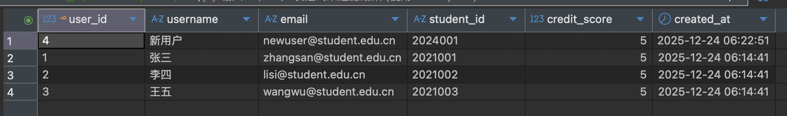

#### 6.1.3 更新用户信息

```sql
UPDATE users 
SET credit_score = 4.5, phone = '13900139001' 
WHERE user_id = 1;
```

**执行结果截图**:
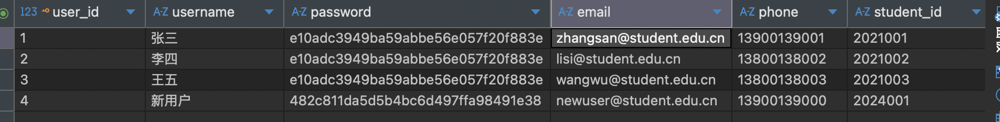

#### 6.1.4 删除用户（级联删除）

```sql
DELETE FROM reviews WHERE reviewer_id = 1 OR reviewed_id = 1;
DELETE FROM transactions WHERE buyer_id = 1 OR seller_id = 1;
DELETE FROM purchase_requests WHERE buyer_id = 1;
DELETE FROM products WHERE seller_id = 1;
DELETE FROM users WHERE user_id = 1;
```

**执行结果截图**:
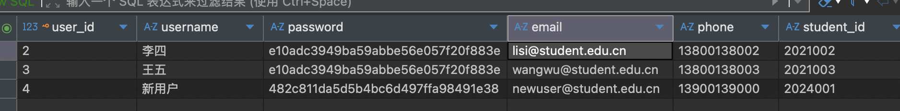

### 6.2 教材信息管理模块

#### 6.2.1 添加教材信息

```sql
INSERT INTO textbooks (isbn, title, author, publisher, edition, course_code, course_name, teacher_name, original_price) 
VALUES ('9787111234568', '数据结构', '严蔚敏', '清华大学出版社', '第3版', 'CS201', '数据结构', '王教授', 45.00);
```

**执行结果截图**:
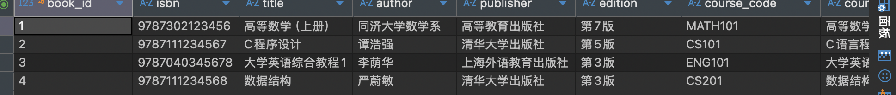

#### 6.2.2 查询教材信息

```sql
SELECT book_id, title, author, course_code, original_price 
FROM textbooks 
WHERE course_code = 'CS101' OR title LIKE '%数学%' 
ORDER BY original_price DESC;
```

**执行结果截图**:
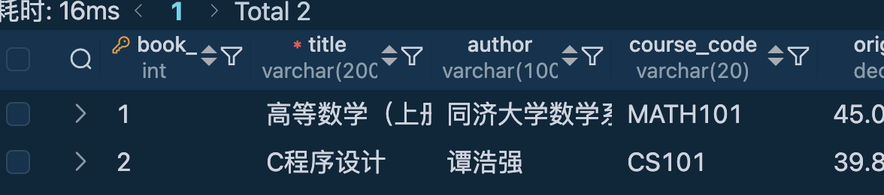

#### 6.2.3 更新教材信息

```sql
UPDATE textbooks 
SET original_price = 42.00 
WHERE book_id = 1;
```

**执行结果截图**:
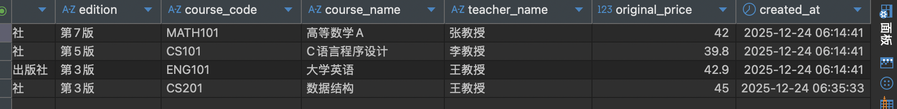

### 6.3 商品发布与管理模块

#### 6.3.1 发布商品

```sql
INSERT INTO products (seller_id, book_id, condition_score, selling_price, description, status) 
VALUES (1, 1, 8, 35.00, '九成新，无笔记，保存完好', 'available');
```

**执行结果截图**:
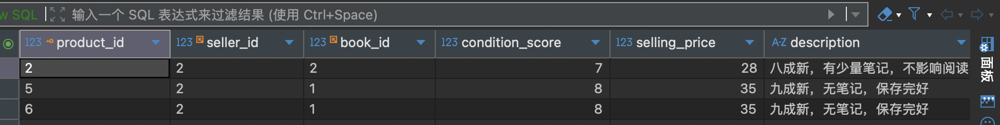

#### 6.3.2 查询商品列表

```sql
SELECT p.product_id, u.username as seller_name, t.title, t.author, 
       p.condition_score, p.selling_price, p.status, p.created_at
FROM products p 
LEFT JOIN users u ON p.seller_id = u.user_id 
LEFT JOIN textbooks t ON p.book_id = t.book_id 
WHERE p.status = 'available' 
ORDER BY p.created_at DESC;
```

**执行结果截图**:
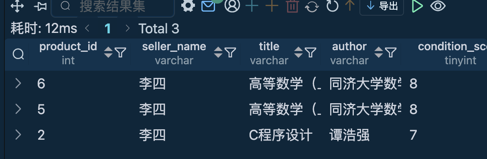

#### 6.3.3 更新商品状态

```sql
UPDATE products 
SET status = 'sold' 
WHERE product_id = 6;
```

**执行结果截图**:
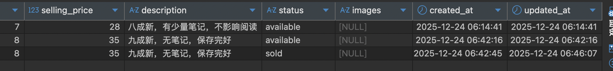

#### 6.3.4 删除商品

```sql
DELETE FROM products 
WHERE product_id = 1;
```

**执行结果截图**:
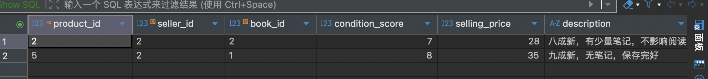

### 6.4 求购需求管理模块

#### 6.4.1 发布求购需求

```sql
INSERT INTO purchase_requests (buyer_id, book_id, max_price, description, status) 
VALUES (2, 1, 30.00, '急需高等数学教材，价格可商量', 'active');
```

**执行结果截图**:
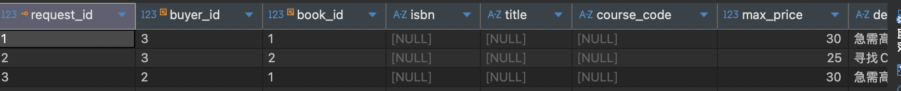

#### 6.4.2 查询求购需求

```sql
SELECT pr.request_id, u.username as buyer_name, t.title, 
       pr.max_price, pr.status, pr.description, pr.created_at
FROM purchase_requests pr 
LEFT JOIN users u ON pr.buyer_id = u.user_id 
LEFT JOIN textbooks t ON pr.book_id = t.book_id 
WHERE pr.status = 'active' 
ORDER BY pr.created_at DESC;
```

**执行结果截图**:
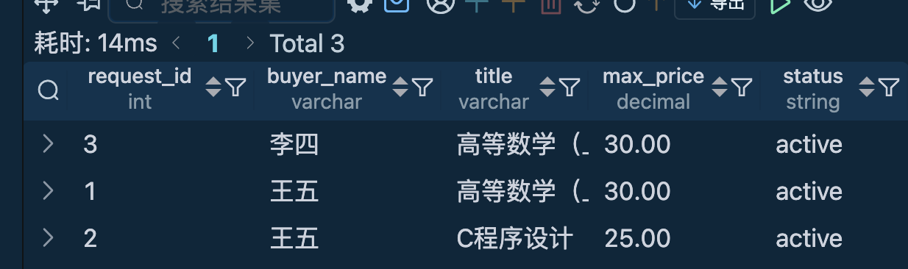

#### 6.4.3 更新求购状态

```sql
UPDATE purchase_requests 
SET status = 'matched' 
WHERE request_id = 1;
```

**执行结果截图**:
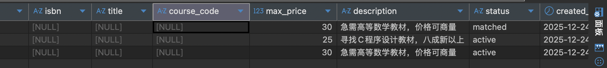

#### 6.4.4 智能匹配查询

```sql
-- 基于ISBN匹配
SELECT p.product_id, t.title, t.author, u.username as seller_name, p.selling_price
FROM products p 
LEFT JOIN textbooks t ON p.book_id = t.book_id 
LEFT JOIN users u ON p.seller_id = u.user_id 
WHERE t.isbn = '9787302123456' AND p.status = 'available'
ORDER BY p.selling_price ASC;
```

**执行结果截图**:


### 6.5 交易管理模块

#### 6.5.1 创建交易

```sql
INSERT INTO transactions (product_id, buyer_id, seller_id, price, status, appointment_time, appointment_location) 
VALUES (1, 3, 1, 35.00, 'pending', '2025-12-25 15:00:00', '图书馆一楼大厅');
```

**执行结果截图**:
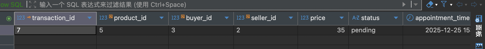

#### 6.5.2 查询交易记录

```sql
SELECT tr.transaction_id, t.title, u1.username as buyer_name, 
       u2.username as seller_name, tr.price, tr.status, 
       tr.appointment_time, tr.appointment_location, tr.created_at
FROM transactions tr 
LEFT JOIN products p ON tr.product_id = p.product_id 
LEFT JOIN textbooks t ON p.book_id = t.book_id 
LEFT JOIN users u1 ON tr.buyer_id = u1.user_id 
LEFT JOIN users u2 ON tr.seller_id = u2.user_id 
ORDER BY tr.created_at DESC;
```

**执行结果截图**:
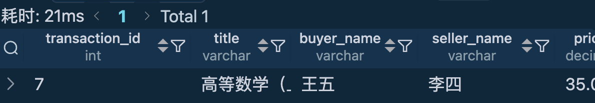

#### 6.5.3 更新交易状态

```sql
UPDATE transactions 
SET status = 'completed' 
WHERE transaction_id = 7;
```

**执行结果截图**:
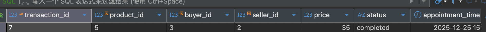

### 6.6 评价系统模块

#### 6.6.1 发布评价

```sql
INSERT INTO reviews (transaction_id, reviewer_id, reviewed_id, book_condition_score, description_accuracy_score, overall_score, comment) 
VALUES (7, 3, 2, 8, 9, 9, '卖家很热情，书保存得很好，和描述一致');
```

**执行结果截图**:
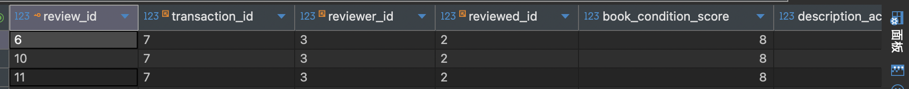

#### 6.6.2 查询评价信息

```sql
SELECT r.review_id, u1.username as reviewer_name, u2.username as reviewed_name,
       t.title, r.overall_score, r.comment, r.created_at
FROM reviews r 
LEFT JOIN users u1 ON r.reviewer_id = u1.user_id 
LEFT JOIN users u2 ON r.reviewed_id = u2.user_id 
LEFT JOIN transactions tr ON r.transaction_id = tr.transaction_id 
LEFT JOIN products p ON tr.product_id = p.product_id 
LEFT JOIN textbooks t ON p.book_id = t.book_id 
ORDER BY r.created_at DESC;
```

**执行结果截图**:
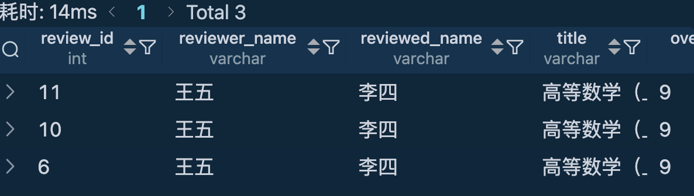

#### 6.6.3 更新信用评分

```sql
-- 根据评价计算用户信用评分
UPDATE users 
SET credit_score = (
    SELECT AVG(r.overall_score) * 0.2 
    FROM reviews r 
    WHERE r.reviewed_id = users.user_id
) 
WHERE user_id = 1;
```

**执行结果截图**:
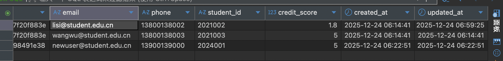

### 6.7 统计查询

#### 6.7.1 用户活动统计

```sql
SELECT u.username,
       COUNT(DISTINCT p.product_id) as products_count,
       COUNT(DISTINCT CASE WHEN p.status = 'sold' THEN p.product_id END) as sold_count,
       COUNT(DISTINCT t.transaction_id) as transactions_count,
       AVG(r.overall_score) as avg_review_score
FROM users u 
LEFT JOIN products p ON u.user_id = p.seller_id 
LEFT JOIN transactions t ON u.user_id = t.buyer_id OR u.user_id = t.seller_id
LEFT JOIN reviews r ON u.user_id = r.reviewed_id
GROUP BY u.user_id, u.username;
```

**执行结果截图**:
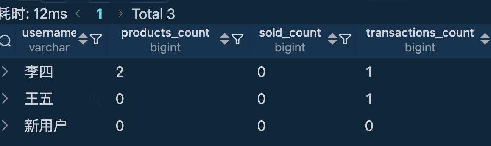

#### 6.7.2 平台统计信息

```sql
SELECT 
    (SELECT COUNT(*) FROM users) as total_users,
    (SELECT COUNT(*) FROM products WHERE status = 'available') as available_products,
    (SELECT COUNT(*) FROM purchase_requests WHERE status = 'active') as active_requests,
    (SELECT COUNT(*) FROM transactions WHERE status = 'completed') as completed_transactions,
    (SELECT AVG(credit_score) FROM users) as avg_credit_score;
```

**执行结果截图**:


---

## 总结

本校园二手教材循环交易平台通过7个数据表的合理设计，完整实现了用户管理、教材信息管理、商品发布、求购需求、交易管理和评价系统等核心功能。系统采用MySQL数据库，支持UTF8MB4字符集，确保了中文数据的正确存储和处理。

### 系统特点：

1. **数据完整性**：通过外键约束确保数据一致性
2. **安全性**：密码MD5加密，用户权限管理
3. **可扩展性**：模块化设计，便于功能扩展
4. **用户友好**：完整的CRUD操作和统计功能
5. **信用体系**：基于评价的信用评分机制

该系统能够有效促进校园内教材的循环利用，为学生提供便捷的交易平台。
